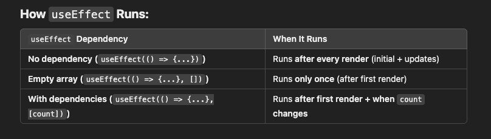
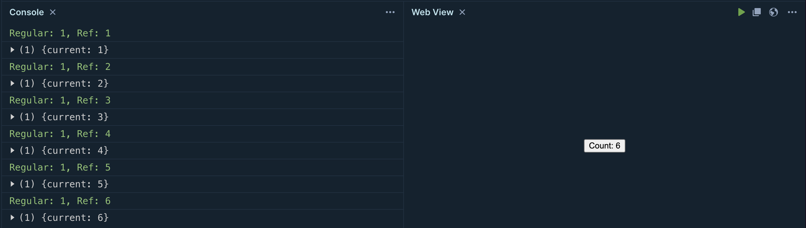
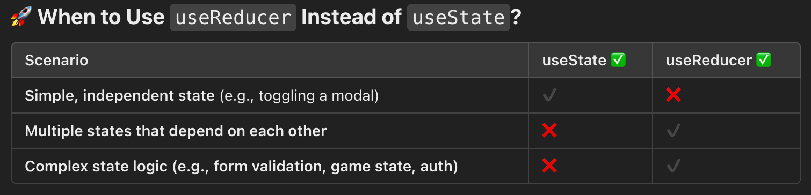
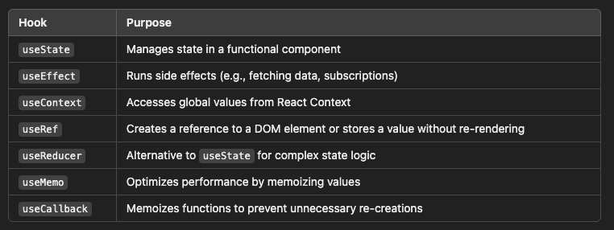

# React Hooks
Pieces of code that help us achieve dynamic rendering in react.
## 1. useState( )
One can say advance form of variables.
```javascript
const [state, setState] = useState(<initial_value>);
```
### Why not use a simple variable instead of this?
- A simple variable will reset after every render while state will not and retain its value.
- When a variable changes it can be seen updating in the console.log( ) but it doesn't change the UI because it doesn't causes a rerender, while whenever a state changes the UI gets rerendered.

## 2. useEffect( )
Once render happens then useEffect runs the lines inside it in affect of that change which caused the rerender.
```javascript
useEffect(()=>{
    // line of code that will be run by useEffect
},[<dependencies>]);
```
### 2.1 Important point to note:
- useEffect will run at least one time no matter what, you render first time it will run or rerender happens still it will run, 
- But how many times it will run can be controlled by using the second parameter of useEffect which is the dependency array
### 2.2 Types of Usage
There are 3 major ways how you can use useEffect.
```javascript
// Type 1
 useEffect(()=>{console.log("hi!")});
```
- This will run every time a render occurs due to state change or whatever reason.
- Note that there is no dependency array only a callback.

```javascript
// Type 2
 useEffect(()=>{console.log("hi!")},[]);
```
- This will run only one time when the initial render will happen.
  
```javascript
// Type 3
 export function App() {
  let [count,setCount] = useState(0);
   useEffect(() => {
    console.log(`The page has been updated! Count is:${count}`);
  },[count]);

  return (
    <div>
    {a}
      <p>Count: {count}</p>
      <button onClick={()=>setCount(count + 1)}>Increase</button>
    </div>
  );
}
```
- This will run (every time count changes +1)
- 1 for the initial render which will show the button and the rest, will be rerenders when button click will change the state and useEffect will run.



## 3. useContext( )
To make states,variables or callbacks become global, we use this hook. In order to avoid prop drilling (passing the prop from parent to granchild node like the below example)
```javascript
function App() {
  const user = "Karam";
  return <Parent user={user} />;
}

function Parent({ user }) {
  return <Child user={user} />;
}

function Child({ user }) {
  return <p>Hello, {user}!</p>;
}
// and this become annoying after some time 
```
**Solution**
- Make them global so that all the childs can access it
- But making global variables is a bad programming practice !
- It is global but to a limited extent means available to limited components. Let me explain what gibberish, I am talking about.
  
**Syntax**
```javascript
import React, { useState, useContext, createContext } from "react";

// 1️⃣ Create a Context
const UserContext = createContext(); // Your Global Bank to store props

function App() {
  const [fname, setFname] = useState("Karam");
  const [lname, setLname] = useState("Abbas");
  return (
    // 2️⃣ Provide the Context value to all children
    <UserContext.Provider value={{fname,lname}}>
      <Parent />
    </UserContext.Provider>
    //Puts limit on who can access the context(the global bank)
    // And the value prop accepts an object which contains the props you want to make global
    // For one thing         value = {state}
    // For multiple things   value = {{state1,state2}}
  );
}

function Parent() {
  return <Child />;
}

function Child() {
  // 3️⃣ Use the Context value directly
  const user = useContext(UserContext);
  return <p>Hello, {user}!</p>;
  //This is how child can access the props we just made global.
}

export default App;
```

**Important Concept**
State Uplifting is simple, declaring the states in the parent component and then passing it down to child by means of props.


## 4. useRef( )
It is used to update and retain some info without causing a re-render. 
### But we can use a simple variable then, it also doesn't causes a rerender just updates itself.
- when useRef updates the value, it doesn't cause rerender and also retains the value if re-render happens by some other state or for any reason.
- a simple variable on the other hand whenever a rerender happens due to its initialization in the component like this 
  ```javascript
  let count = 0;
  ```
  reinitializes every time to zero for any rerender while useRef maintains the value even if rerenders happens.

**Example**

```javascript
 function App() {
  // Regular variable resets to 0 on every render
  let regularCount = 0;
  
  // useRef maintains its value between renders
  const refCount = useRef(0);
  
  // State causes re-renders when changed
  const [stateCount, setStateCount] = useState(0);
  
  function handleClick() {
    regularCount+=1;  // Lost after any re-render
    refCount.current++;  // Retain value between renders
    // refCount returns an object with a current named 
    // variable, which retains the original value
    console.log(`Regular: ${regularCount}, Ref: ${refCount.current}`);
    // To see what refCount contains
    console.log(refCount);
    setStateCount(stateCount + 1);  // To Cause a re-render
  }
  
  return <button onClick={handleClick}>Count: {stateCount}</button>;
}
```
**Output**
When button was clicked the useState changed and caused a rerender
**Important thing to note**
The useRef is retaining its value while the variable initializes to 0 and due to onclick it becomes 1 and remains there due to reinitialization for every rerender.


## 5. useReducer( )
When interdependent states are faced managing them and writing for them becomes messy, and in order to handle interdependent states an easier approach useReducer( ) was introduced. It is an alternative of useState( ) for more complex state management.
**Syntax**
```javascript
let [state,dispatch] = useReducer(reducer,initialState)
```
- State : the interdependent states we want to manage
- dispatch : a call to perform an action on the state
- Reducer : the function which performs the action given by 'Dispatch' on the 'State'.
  
**Example with useState**
```javascript
import React, { useState } from "react";

function UserForm() {
  // Multiple states
  const [name, setName] = useState("");
  const [age, setAge] = useState("");
  const [isAdmin, setIsAdmin] = useState(false);

  function handleAgeChange(newAge) {
    setAge(newAge);
    if (newAge >= 18) {
      setIsAdmin(true); // Interdependent logic
    } else {
      setIsAdmin(false);
    }
  }

  return (
    <div>
      <input 
        type="text" 
        placeholder="Name" 
        value={name} 
        onChange={(e) => setName(e.target.value)} 
      />
      <input 
        type="number" 
        placeholder="Age" 
        value={age} 
        onChange={(e) => handleAgeChange(e.target.value)} 
      />
      <p>{name} is {age} years old and is {isAdmin ? "an Admin" : "not an Admin"}</p>
    </div>
  );
}

export default UserForm;

```

**Example with useReducer**
```javascript
import React, { useReducer } from "react";

// Reducer function (handles all state updates in one place)
function reducer(state, action) {
  switch (action.type) {
    case "SET_NAME":
      return { ...state, name: action.payload };
    case "SET_AGE":
      return { 
        ...state, 
        age: action.payload, 
        isAdmin: action.payload >= 18 // Automatically updates isAdmin
      };
    default:
      return state;
  }
}

function UserForm() {
  const [state, dispatch] = useReducer(reducer, { name: "", age: "", isAdmin: false });

  return (
    <div>
      <input 
        type="text" 
        placeholder="Name" 
        value={state.name} 
        onChange={(e) => dispatch({ type: "SET_NAME", payload: e.target.value })} 
      />
      <input 
        type="number" 
        placeholder="Age" 
        value={state.age} 
        onChange={(e) => dispatch({ type: "SET_AGE", payload: Number(e.target.value) })} 
      />
      <p>{state.name} is {state.age} years old and is {state.isAdmin ? "an Admin" : "not an Admin"}</p>
    </div>
  );
}

export default UserForm;

```
**Important Note**
- When managing useState becomes difficult use the useReducer
- When you have to separate the state logic from the component use the useReducer
- Else if its manageable use the useState simple.
  

## 6. useMemo( )
It caches the results of heavy computation, instead of doing them again and again till the dependency changes.

## Syntax
```javascript
const result = useMemo(()=> heavyComputation(dependency),[dependency])
```
**Problem**
```javascript
import React, { useState } from "react";

function ExpensiveComponent() {
  const [count, setCount] = useState(0);
  const [number, setNumber] = useState(5);

  function slowFunction(num) {
    console.log("Computing...");
    for (let i = 0; i < 1e9; i++) {} // Simulating heavy computation
    return num * 2;
  }

  const result = slowFunction(number); // ⚠️ Runs every render!
// Despite of which button was clicked
// But it should only run for the Change number button as it has no link with the Increase Count
  return (
    <div>
      <h2>Expensive Computation: {result}</h2>
      <button onClick={() => setCount(count + 1)}>Increase Count: {count}</button>
      <button onClick={() => setNumber(number + 1)}>Change Number</button>
    </div>
  );
}

export default ExpensiveComponent;

```
Every time the number changes a heavy computation is performed on that, but it should only happen in case of number change not for count change which is happening here as a rerender happen no matter why the heavy computation is done again and again causing inefficiency.

**Solution**
```javascript
import React, { useState, useMemo } from "react";

function ExpensiveComponent() {
  const [count, setCount] = useState(0);
  const [number, setNumber] = useState(5);

  function slowFunction(num) {
    console.log("Computing...");
    for (let i = 0; i < 1e9; i++) {} // Simulating heavy computation
    return num * 2;
  }

  const result = useMemo(() => slowFunction(number), [number]); // ✅ Runs only when `number` changes

  return (
    <div>
      <h2>Expensive Computation: {result}</h2>
      <button onClick={() => setCount(count + 1)}>Increase Count: {count}</button>
      <button onClick={() => setNumber(number + 1)}>Change Number</button>
    </div>
  );
}

export default ExpensiveComponent;

```
Here now the heavy computation will happen once and then will be cached and will happen again only when the dependency of slowFunction( ) which is [number] wil change. 

**Important point**
useMemo only caches the computation results meaning the values to be stored in the variable not the function that computes the heavy computation.

## 7. useCallback( )
It caches the whole function so that it doesn't get recreated with every render just like the case of variable which gets recreated with every rerender. Now to go more deep on optimization we use useCallback( ) to cache the function once and use this same creation in every rerender instead of creating it from scratch with every rerender.

**Problem**
```javascript
import React, { useState } from "react";
import Child from "./Child"; // A separate component

function Parent() {
  const [count, setCount] = useState(0);

  const handleClick = () => {
    console.log("Clicked!");
  }; // ❌ gets recreated every time the count changes
  //  and a rerender happens. 

  // the function is very light weight so it doesn't effect much but 
  // as the app goes complex these tiny optimization makes exponential 
  // differences.

  return (
    <div>
      <Child handleClick={handleClick} />
      <button onClick={() => setCount(count + 1)}>Increase Count: {count}</button>
    </div>
  );
}

export default Parent;

```

**Solution**
```javascript
import React, { useState, useCallback } from "react";
import Child from "./Child";

function Parent() {
  const [count, setCount] = useState(0);

  // ✅ Cached function - does NOT get recreated on every render
  const handleClick = useCallback(() => {
    console.log("Clicked!");
  }, []);

  return (
    <div>
      <Child handleClick={handleClick} />
      <button onClick={() => setCount(count + 1)}>Increase Count: {count}</button>
    </div>
  );
}
export default Parent;
```

# Quick Summary

<<<<<<< Updated upstream
=======

# React Props
## Function as a Prop
Always pass the functional prop in a wrapper callback like this:
```javascript
<Person
            n={obj.name}
            a={obj.age}
            y={obj.isYoung}
            clicked={()=>btnHandler2("Hashir")}
/>
```
And in order to make this function run you need to do the following:

```javascript
return (
       <div>
            <p onClick={props.clicked}>Hi! my name is {props.n} and I'm {props.a} years old</p>
            <input type="text" value={props.n}></input>
        </div>
    );
```
Whenever you will click on P tag the function will be called automatically.

>>>>>>> Stashed changes
